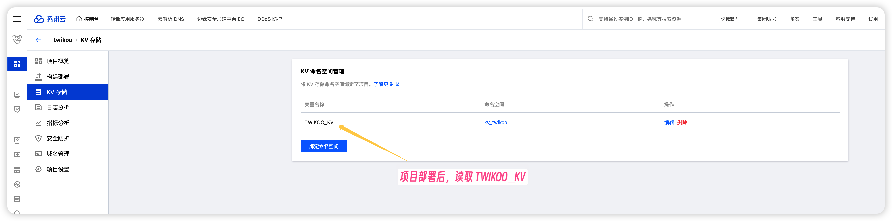
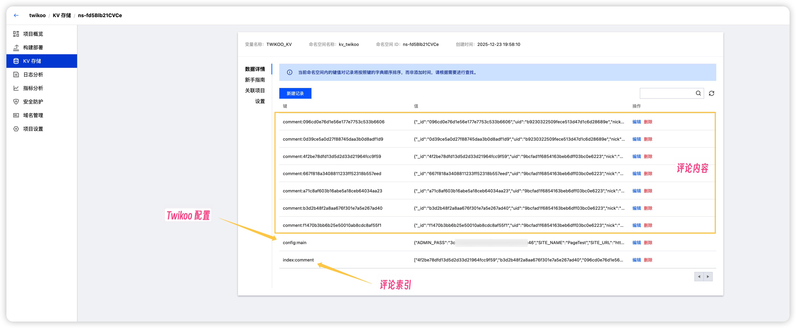

# Twikoo EdgeOne Pages 版本

🚀 **专为腾讯云 EdgeOne Pages 平台优化的 Twikoo 评论系统**

本版本是 twikoo 项目针对 EdgeOne Pages 平台的适配版本，提供了简化的部署方案和优化的性能表现。

<a href="https://twikoo.js.org/"></a>

----

[](./LICENSE)

一个**简洁**、**安全**、**免费**的静态网站评论系统。<br>
A **simple**, **safe**, **free** comment system.  

## 特色 | Features

* 免费搭建（使用 EdgeOne Pages 部署评论后台）
* 简单部署（支持 EdgeOne Pages 一键部署）


## 快速上手 | Quick Start

Twikoo 的完整教程，参考 Twikoo 官方项目: https://github.com/twikoojs/twikoo 以及 Twikoo 的[快速上手](https://twikoo.js.org/quick-start.html)

本项目只是适配了 EdgeOne Pages 平台的服务端，所以在部署时，需要注意以下几点：

### EdgeOne Pages 部署 | EdgeOne Pages Deployment

本项目已适配腾讯云 EdgeOne Pages 平台，提供简化的部署方案。

#### 部署步骤 | Deployment Steps

1. **准备工作**
   - 注册腾讯云账号并开通 EdgeOne 服务

2. **创建 EdgeOne Pages 项目**
   - 登录腾讯云 EdgeOne 控制台
   - 创建新的 Pages 项目
   - 选择 GitHub 作为代码源
   - 关联本仓库

3. **配置环境变量**
   - 在 EdgeOne Pages 控制台创建 KV 命名空间
   - 将 KV 命名空间绑定到项目，变量名设为：`TWIKOO_KV`

4. **触发部署**
   - 推送代码到仓库，EdgeOne Pages 会自动触发部署。或者直接本地`edgeone pages deploy`部署。
   - 部署完成后，获取你的 EdgeOne Pages 地址作为 twikoo 的环境配置

5. **前端配置**
   ```html
   <script>
     twikoo.init({
       envId: 'your-edgeone-pages-url',  // EdgeOne Pages 地址
       el: '#tcomment'
     })
   </script>
   ```

关键步骤截图:



#### 环境配置要求 | Environment Requirements

- **Node.js**: 18+ (EdgeOne Pages 自动提供)
- **KV 存储**: 必须创建并绑定 TWIKOO_KV 命名空间

#### 常见问题解决方法 | Common Issues

1. **KV 存储连接失败**
   - 检查 KV 命名空间是否正确绑定
   - 确认变量名为 `TWIKOO_KV`
   - 重新部署项目

2. **邮件通知不工作**
   - 验证 SMTP 服务配置是否正确
   - 检查邮箱是否开启了 IMAP/SMTP 服务
   - 确认邮箱密码或应用专用密码

3. **评论提交失败**
   - 检查网络连接和 Edge Function 地址
   - 确认 KV 存储空间是否充足
   - 查看部署日志排查错误


#### 注意事项 | Important Notes

当前测试以下功能正常:
- 评论提交、评论回复、评论点赞、评论删除等前台评论操作。
- 邮件通知、Push 提醒正常。
- IP 获取、归属地正常（使用 EdgeOne Function 提供的地址库）。
- UA 获取、浏览器类型正常。

KV 存储的评论:



## 开发 | Development

### EdgeOne Pages 开发 | EdgeOne Pages Development

本项目结构专为 EdgeOne Pages 平台优化：

``` sh
# 安装 EdgeOne CLI (在 CloudStudio 中已预装)
npm install -g edgeone

# 本地开发调试
edgeone pages dev

# 项目检查
node build.cjs
```

**项目结构说明：**
```
├── edge-functions/
│   └── index.js          # Edge Function 主入口（处理 KV 存储）
├── node-functions/
│   └── api/
│       └── notify.js      # Node Function 通知服务（处理邮件）
├── package.json           # 项目依赖配置
├── build.cjs              # 构建检查脚本
└── .cnb.yml               # CNB 环境配置（可选）
```

**开发注意事项：**
- Edge Functions 使用 KV 存储作为数据库
- Node Functions 用于处理邮件通知等需要第三方服务的功能
- 环境变量在 EdgeOne Pages 控制台配置
- 本地开发时需要模拟 KV 环境

如果您的改动能够帮助到更多人，欢迎提交 Pull Request！

## 许可 | License

<details>
<summary>MIT License</summary>

[](https://app.fossa.com/projects/git%2Bgithub.com%2Fimaegoo%2Ftwikoo?ref=badge_large)

</details>
